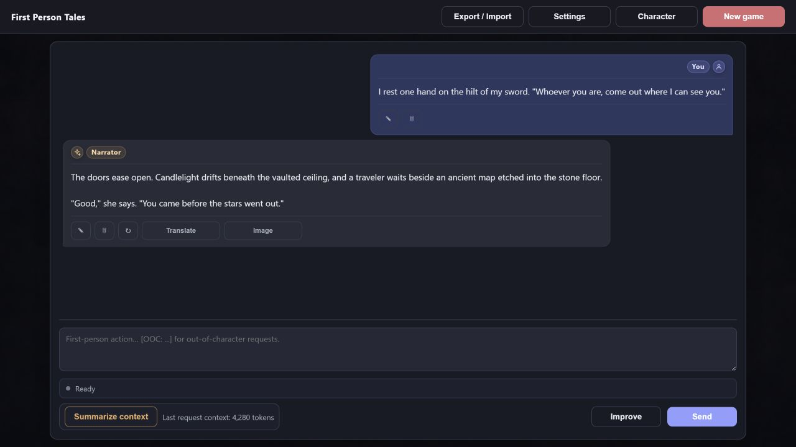

# First Person Tales

A local, single-player AI roleplaying game powered by [Venice.ai](https://venice.ai/). Write what your character says and does; the narrator continues the story. Your history stays visible, editable, and under your control.



## Project status

Project is finished no more updates are planned.

## For players

### What you need

- [Node.js](https://nodejs.org/) 20 or newer. The game is tested on Windows and should also work on macOS and desktop Linux.
- A Venice.ai account, an [API key](https://venice.ai/settings/api), and available API credits.

Venice API usage is billed separately from Venice chat subscriptions.

### Install once

Download this project, open its folder in a terminal, and run:

```powershell
npm install
```

### Start playing

Whenever you want to play, run:

```powershell
npm start
```

Open [http://127.0.0.1:3000](http://127.0.0.1:3000) in your browser. The first launch prepares the game automatically and takes a little longer; later launches start immediately.

Keep the terminal window open while you play. Press `Ctrl+C` when you want to stop the game.

### Choose your character

The game includes a ready-to-play character named Rowan. You can start with Rowan immediately or create your own character before your first story.

Open **Character** in the top bar to view and edit the active character. Your changes are saved to a personal, Git-ignored `prompts.local.yaml` file and take effect without restarting the game.

> **Keep one character per story.** The narrator reads the same character sheet on every turn, so changing the character's name mid-story can make the narrator contradict scenes you have already played. Create or switch characters before starting a new game.

Always keep the `# PC (Player character)` heading. It identifies the described character as the player-controlled protagonist whose actions and perspective anchor the story.

As an unofficial power-user trick, the current prompt format also allows a `# World Description` section below the character. For example:

```markdown
# World Description

A world of swords and magic where four countries fight for control of the continent.

## Locations

### Lake

A deep mountain lake surrounding the ruins of an ancient observatory.

### Castle

A fortified royal residence overlooking the northern trade road.

## Characters

### Alan

A wandering swordsman searching for his missing brother.

### Morgana

A court mage whose loyalties are deliberately unclear.

## Rules

- Magic is rare and used only by trained mages.
- Crossing a national border without permission is a serious crime.
```

This works because the entire Character editor is included in narrator, summary, and image-prompt preparation requests. It is not a dedicated world editor or an automatically tracked world state—just a useful consequence of the current architecture. Keep world notes concise because they use context on every relevant request.

### Connect Venice and begin

1. Open **Settings**.
2. Paste your Venice API key and click **Refresh models**. This saves the key and loads the available models.
3. Keep the tested default models or choose different ones from the refreshed lists:
   - **Narrator:** `aion-labs-aion-3-0`.
   - **Images:** `krea-2-turbo`.
4. Click **Save**.
5. Describe the opening scene or your character's first action, then click **Send**.

If a default model is no longer available on Venice, select another model manually. The narrator model continues the story; the image model is only used when you explicitly generate a picture.

Advanced users may set `VENICE_API_KEY` before starting the game instead. An environment key has priority over the system keychain and is read-only in Settings.

For example:

```text
I wake beside a dying campfire at the edge of an unfamiliar forest.
I check my satchel and listen for movement between the trees.
```

Use `[OOC: ...]` when you want to give the narrator instructions outside your character:

```text
[OOC: Describe the setting before the next encounter.]
```

### Story controls

- **Send** continues the story using the visible history.
- **Improve** rewrites your draft before you send it.
- **Translate** translates a message into the language selected in Settings.
- **Character** edits the active player character (see [Choose your character](#choose-your-character)).
- **Summarize context** condenses the active story context; **Undo summary** restores the previous state. Both sit beside the latest-request token counter. Undo asks first if it would also remove newer turns.
- **Image** prepares an editable scene prompt and generates an image only after you confirm it.
- **Export / Import** saves or restores your story. Imports create a backup first.
- **New game** clears the current story. Export anything you want to keep beforehand.

Story turns, translations, improvements, summaries, and images are requested explicitly. Venice API requests can cost money. The game never summarizes, removes context, generates images, or retries uncertain paid requests automatically.

The quiet status line under the composer always shows whether the game is ready or which explicit operation is running, such as `Narrator is thinking…`.

### Saves and privacy

Your current story, settings, generated images, and backups are stored locally in `data/`, which is ignored by Git. Export a JSON save before moving or removing the project if you want to keep a story.

When entered in Settings, your Venice API key is stored in the current user's native credential manager: Windows Credential Manager, macOS Keychain, or the Secret Service used by desktop Linux. The key is not stored in `data/`, included in story exports, returned to the browser, or written to logs.

Windows is the platform tested by the maintainer. The same integration should work on macOS and desktop Linux through their native keychains, but those platforms have not been manually verified. Linux requires an available, unlocked Secret Service such as GNOME Keyring or KDE Wallet; headless Linux and some WSL environments should use the read-only `VENICE_API_KEY` environment variable instead.

Requests containing your story are sent to Venice only when you use a feature that requires AI.

The game is intended for one player on your own computer. Do not expose it to your local network or the internet.

### Troubleshooting

- **npm shows funding, deprecation, or low-severity audit notices:** these are warnings, not installation failures. If installation finishes successfully, continue with `npm start`. Do not run `npm audit fix --force`.
- **No narrator models appear:** enter your API key, click **Refresh models**, and check that Venice API access is enabled.
- **The API key cannot be saved:** make sure the current user's system credential manager is available and unlocked. On Linux without a desktop keychain, use `VENICE_API_KEY`. If Settings reports an older encrypted key, enter the key again.
- **A saved key stops working after running tests:** older image tests could overwrite the real key with a test value or delete it. Update the code, rebuild with `npm run build`, restart the app, and enter your key once more. Tests now use an isolated in-memory credential store and cannot access the native keychain.
- **A request fails with HTTP 401 or 402:** check your API key and available Venice API credits.
- **A story is missing after moving the project:** import a previously exported JSON save or restore your local `data/` directory.
- **A very large story becomes slow or can no longer be imported:** the complete visible history is kept in one local save, so an extremely large file may eventually exceed browser or import limits. Export the story first. If the story continued after its latest summary, summarize it again, then copy the newest `# Story Summary`, start a new game, paste that summary as the first message, and continue playing from it.

## For developers

This section is only for contributors changing the source code. Players do not need any of these commands.

After installing dependencies with `npm install`, start the development server with:

```powershell
npm run dev
```

The development server provides live reloading at [http://127.0.0.1:5173](http://127.0.0.1:5173).

Check changes with:

```powershell
npm test
npm run check
npm run build
```

- `npm test` runs automated tests using provider stubs and isolated in-memory credentials; it does not access your native keychain or make paid Venice API requests.
- `npm run check` validates Svelte and TypeScript.
- `npm run build` rebuilds the version launched by `npm start` after changing the source code.

First Person Tales uses SvelteKit, Svelte 5, TypeScript, and the Venice API.

## Philosophy

One player action produces one visible result. The narrator receives the story you can see, and you can edit, resend, delete, or manually summarize anything that no longer fits the story you want. There is no hidden memory maintenance, automatic context removal, background media work, or silent retry of a potentially paid request. See [PHILOSOPHY.md](PHILOSOPHY.md) for the full design principles.

## License

[MIT](LICENSE)
