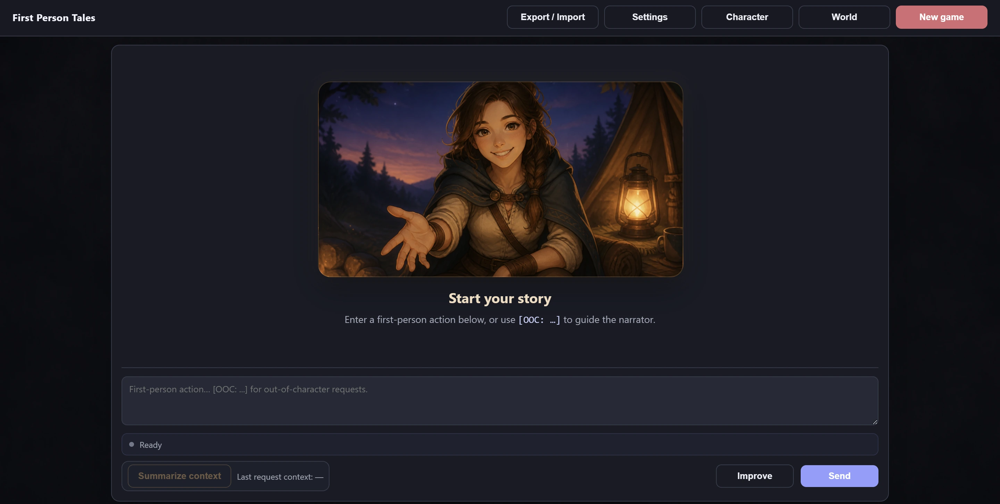
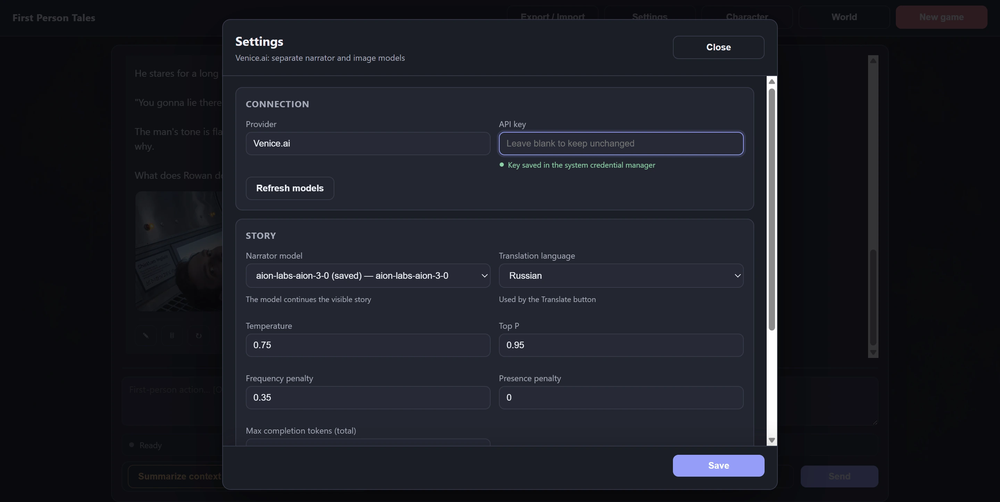
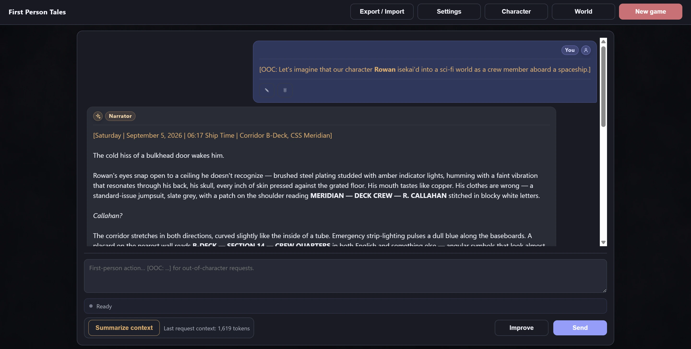
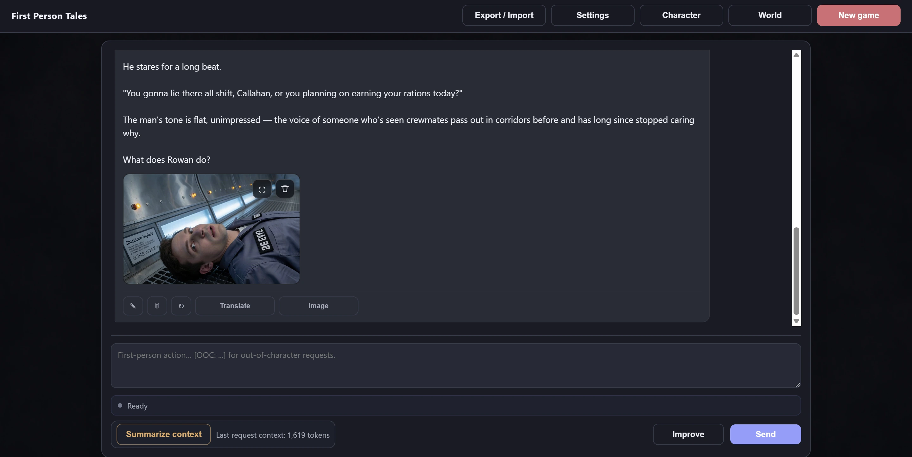

# First Person Tales

A local, single-player AI roleplaying game powered by [Venice.ai](https://venice.ai/). Write what your character says and does; the narrator continues the story. Shape the setting, illustrate a scene, and keep your history visible, editable, and under your control.



## Quick start

You need **Node.js 20 or newer**, a [Venice API key](https://venice.ai/settings/api), and available API credits. Venice API usage is billed separately from Venice chat subscriptions. Windows is the tested platform; see [other platforms](#other-platforms) below.

### 1. Install and launch

Download the project, open its folder in a terminal, and run:

```powershell
npm install
npm start
```

Open [http://127.0.0.1:3000](http://127.0.0.1:3000). The first launch builds the game automatically and takes a little longer. For later launches, just run `npm start`.

Keep the terminal open while playing. Press `Ctrl+C` there to stop the game.

### 2. Connect Venice

1. Open **Settings**.
2. Paste your API key and click **Refresh models**. This saves the key in your system credential manager and loads the model lists.
3. Choose a narrator and image model, then click **Save**. The defaults are `aion-labs-aion-3-0` and `krea-2-turbo`; if one is unavailable, select another from the refreshed list.

<details>
<summary>See Settings</summary>



</details>

### 3. Begin a story

Start with the included character **Rowan**, or open **Character** to write your own description. **World** holds optional setting details; leaving it empty lets you establish the world through play.

Write an opening action and click **Send**:

```text
I wake beside a dying campfire at the edge of an unfamiliar forest.
I check my satchel and listen for movement between the trees.
```

Use `[OOC: ...]` to give directions outside your character:

```text
[OOC: Set this story aboard a spaceship. Describe the crew and my surroundings.]
```



## Your story, your controls

| Control | What it does |
| --- | --- |
| **Send / Stop** | Ask the narrator to continue, or stop a request in progress. |
| **Improve** | Rewrite your draft before sending it. |
| **Edit / Resend / Regenerate** | Adjust a message or request a different continuation. Resending or regenerating an earlier turn replaces the story after that point. |
| **Translate** | Translate a narrator message into the language selected in Settings. |
| **Summarize context / Undo summary** | Manually condense the active context or restore the previous context. The visible history stays available after summarizing. Undo asks first if it would also remove newer turns. |
| **Export / Import** | Save or restore the story as JSON; Markdown export is also available for reading. Import replaces the current story and creates a backup first. |
| **New game** | Clear the current story and its images. Export anything you want to keep first. |

The token counter shows the context size of the latest narrator request. A reminder may suggest summarizing, but the decision is always yours.

AI actions can cost Venice API credits. There are no automatic summaries, background image jobs, hidden memory updates, or silent retries of requests whose outcome is uncertain. Stopping a request cannot guarantee that Venice has not already processed or billed it.

### Character and world

**Character** describes the player. **World** can hold setting, lore, locations, other characters, organizations, or rules. Both descriptions are included in narrator, summary, and image-prompt preparation requests, so keep them focused.

Use one character per story: changing their identity halfway through can contradict earlier scenes. Set up a different character before starting a new game. Clearing **World** removes that description from future AI requests.

Descriptions are saved in your Git-ignored `prompts.local.yaml` and take effect without restarting. First-level Markdown headings (`#`) are reserved for system sections; the editors save them as second-level headings (`##`). The system templates remain in `prompts.yaml`.

### Illustrate a scene

Click **Image** on a narrator message and describe the subject or moment you want to show. Prepare the prompt, edit it if needed, then explicitly generate the image. The result is attached to that message, where you can open it at full size or delete it.



## Saves and privacy

The game saves your current story automatically on your computer:

| Location | Contents |
| --- | --- |
| `data/` | Current story, settings, generated images, and backups. |
| `prompts.local.yaml` | Your character and world descriptions. |
| System credential manager | Your Venice API key. |

**A JSON export contains the story, translations, and summary state. It does not contain images, settings, or character/world descriptions.** For a full local backup or move, stop the app and keep `data/` and `prompts.local.yaml` as well. On another computer, enter the API key again in Settings. Importing a story does not restore its old images.

The API key is not returned to the browser, written to logs, or included in story exports. Advanced users can set `VENICE_API_KEY` before launching instead; it takes priority over the system keychain and is read-only in Settings.

Your story and relevant descriptions are sent to Venice when you use an AI feature. Local storage does not make AI requests offline. Keep personal saves and descriptions private; they are excluded from Git by default.

This is an application for one player on their own computer. **Do not expose its server to your local network or the internet.**

### Other platforms

Windows is the platform tested by the maintainer. macOS and desktop Linux should work through their native keychains, but have not been manually verified. Linux needs an available, unlocked Secret Service such as GNOME Keyring or KDE Wallet. Headless Linux and some WSL environments should use `VENICE_API_KEY` instead.

## Updating

1. Stop the game and back up `data/` and `prompts.local.yaml`.
2. Update the project source, preserving those local files.
3. In the project folder, run:

```powershell
npm install
npm run build
npm start
```

Rebuilding matters: if a build already exists, `npm start` launches it without rebuilding. Restart the app after an update.

<details>
<summary>Upgrading from the older character editor</summary>

Older versions stored editable text under `player_character`. The current format keeps system headings separate from your descriptions. If the app reports that `prompts.local.yaml` uses the old format:

1. Stop the game.
2. Copy your character description and any world description from the old file somewhere safe.
3. After backing it up, delete the old `prompts.local.yaml`.
4. Update the source, run `npm run build`, and restart with `npm start`.
5. Paste only the descriptions into **Character** and **World**, without the old system headings.

The app reports this situation rather than silently rewriting the old file.

</details>

## Troubleshooting

- **No narrator models appear:** enter the API key, click **Refresh models**, and check that Venice API access is enabled.
- **HTTP 401 or 402:** check your API key and available Venice API credits.
- **A request stops at `max_completion_tokens`:** check the narrator token limit in Settings. The default is 8000 because this budget includes reasoning as well as the visible answer. Lower limits can run out before an answer is ready, even when the requested reply is short.
- **The key cannot be saved:** make sure your system credential manager is available and unlocked. On Linux without a desktop keychain, use `VENICE_API_KEY`.
- **npm prints funding, deprecation, or low-severity audit notices:** these are not necessarily installation failures. If installation succeeds, continue with `npm start`. Do not run `npm audit fix --force`.
- **The story is missing after moving the project:** restore your `data/` directory or import a JSON export. Restore `prompts.local.yaml` separately for your descriptions.
- **A very large story becomes slow or cannot be imported:** export it first. If play continued after the latest summary, summarize again, then copy the newest **Story Summary**, start a new game, and use it as the first message. Keep the export as your complete archive. Summarizing alone does not shrink the visible history file.

<details>
<summary>A saved API key stopped working after running tests on an older version</summary>

Older image tests could overwrite or delete the real key. Update the code, rebuild, restart the app, and enter the key once more. Tests now use isolated in-memory credentials and block access to the native keychain.

</details>

## Project status

Planned feature development is complete. First Person Tales remains a focused local game; future maintenance may address concrete bugs.

## For developers

After `npm install`, run `npm run dev` for live reloading at [http://127.0.0.1:5173](http://127.0.0.1:5173).

```powershell
npm test
npm run check
npm run build
```

Tests use provider stubs and in-memory credentials; they do not make paid Venice requests or access your native keychain. `check` validates Svelte and TypeScript; `build` prepares the version used by `npm start`.

Built with SvelteKit, Svelte 5, TypeScript, and the Venice API. See [PHILOSOPHY.md](PHILOSOPHY.md) for the design principles: visible history, manual context management, and explicit AI actions.

## License

[MIT](LICENSE)
