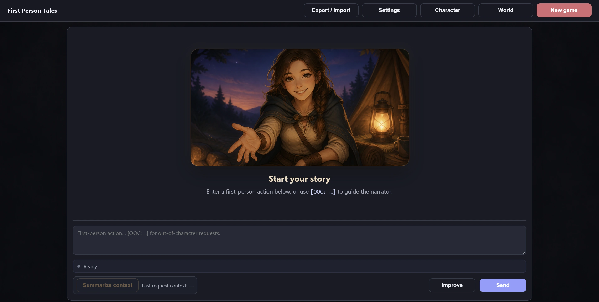
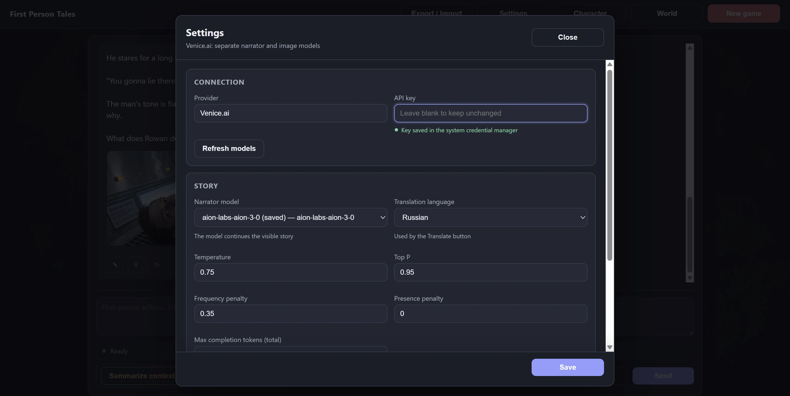
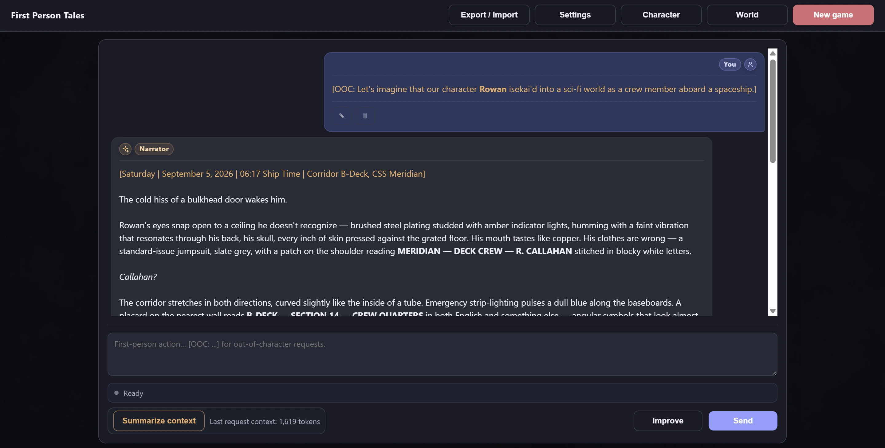
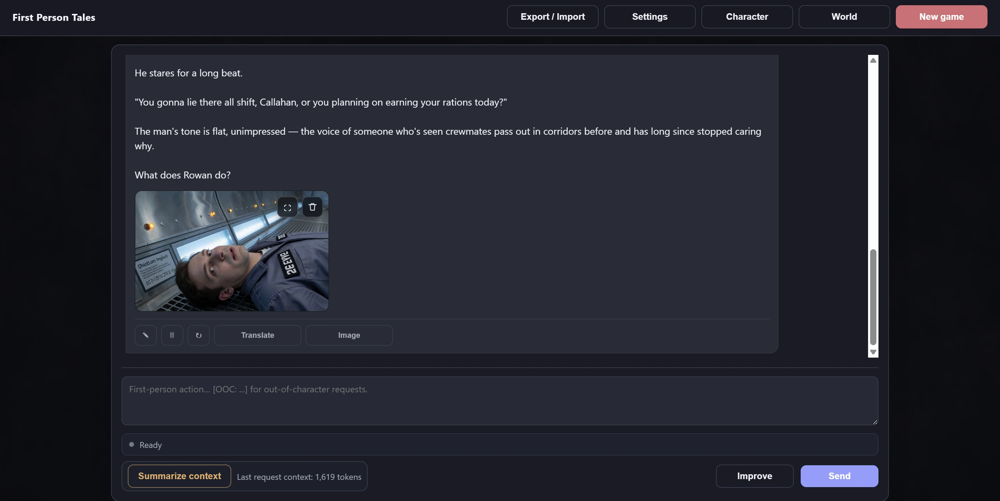

# First Person Tales

A local, single-player AI roleplaying game powered by [Venice.ai](https://venice.ai/). You write what your character says and does; the narrator continues the story. Your history stays visible and editable, your saves stay on your computer, and every AI request is started by you.



## What you need

- **Node.js 20 or newer** — [nodejs.org](https://nodejs.org/).
- A **[Venice API key](https://venice.ai/settings/api)** with available API credits. Venice API usage is billed separately from a Venice chat subscription.
- Windows is the platform tested by the author; macOS and Linux usually work too — see [Other platforms](#other-platforms).

## Quick start

### 1. Install and launch

Download the project, open its folder in a terminal, and run:

```powershell
npm install
npm start
```

Then open [http://127.0.0.1:3000](http://127.0.0.1:3000). The first launch builds the game and takes a little longer; later launches start faster. Keep the terminal open while you play and press `Ctrl+C` there to stop the game.

### 2. Connect Venice

1. Open **Settings**.
2. Paste your API key and click **Refresh models**. The key is stored in your system credential manager, not in the project files.
3. Pick a narrator model and an image model, then click **Save**. The defaults are `aion-labs-aion-3-5` and `krea-2-turbo`; if one of them is unavailable, choose another from the refreshed list. Saving never replaces a model you already selected.

<details>
<summary>See Settings</summary>



</details>

### 3. Begin a story

Start with the included character **Rowan**, or open **Character** and write your own. **World** is optional setting material; leave it empty and establish the world through play instead.

Write an opening action and click **Send**:

```text
I wake beside a dying campfire at the edge of an unfamiliar forest.
I check my satchel and listen for movement between the trees.
```

Use `[OOC: ...]` when you want to give the narrator instructions outside your character:

```text
[OOC: Let's imagine that our character Rowan isekai'd into a sci-fi world as a crew member aboard a spaceship.]
```



## Playing

| Control | What it does |
| --- | --- |
| **Send / Stop** | Ask the narrator to continue, or stop a request in progress. |
| **Improve** | Rewrite your draft before sending it. |
| **Edit / Resend / Regenerate** | Adjust a message or ask for a different continuation. Resending or regenerating an earlier turn replaces everything after that point in the story. |
| **Translate** | Translate a narrator message into the language chosen in Settings. |
| **Summarize context / Undo summary** | Manually condense the active context, or restore the previous context. Your visible history stays; only what is sent as context changes. Undo asks first if it would also remove newer turns. |
| **Export / Import** | Save or restore history, character, and world together as one JSON file. Import makes a text-only backup first, then replaces the active game. Markdown exports are for reading, not for import. |
| **New game** | Clears the current story and its images. Export anything you want to keep first. |

The token counter shows how large the context of the latest narrator request was. The app may suggest summarizing, but nothing happens unless you decide it.

AI actions can cost Venice API credits. There are no automatic summaries, no background image jobs, no hidden memory updates, and no silent retries of requests whose outcome is unknown. Stopping a request cannot guarantee that Venice has not already processed or billed it.

### Character and world

**Character** describes the person you play. **World** can hold a setting, lore, locations, other characters, organizations, or rules. Both are sent with narrator, summary, and image-prompt requests, so keep them focused on what the story needs.

Use one character per story: changing identity halfway through can contradict earlier scenes. Set up a different character before starting a new game. Clearing **World** removes that description from future AI requests.

Both live in your Git-ignored `prompts.local.yaml` and take effect without restarting. Limits: **10,000 characters** for the character and **30,000 characters** for the world, counted exactly as you typed them. The editor shows a small counter in the lower right corner; if the text is over the limit, **Save** reports it and keeps your text so you can shorten it yourself. Nothing you write is rewritten: your own Markdown, including first-level headings (`#`), is sent to the narrator as you wrote it, and the system templates that frame it stay in `prompts.yaml`. If another tab loads a different game, reopen the description editor before saving.

### Illustrating a scene

Click **Image** on a narrator message and describe the subject or moment you want to see: a person, a group interacting, an item, or a location. Prepare the prompt, edit it if you want, then confirm generation. The result is attached to that message, where you can view it at full size or delete it.

In **Settings → Media → Image style** you can choose from 12 styles, including anime, photorealistic, cinematic, watercolor, manga, and pixel art. **None (prompt only)** is the default. A style adds plain text such as `Style: anime` to the prompt, so the scene prompt stays editable and the model's prompt limit includes that suffix. Reopen the dialog after changing Settings; how closely the result follows the style depends on the chosen image model.



## Saves and privacy

The game saves your story automatically on your own computer:

| Location | Contents |
| --- | --- |
| `data/` | Current story, settings, generated images, and backups. |
| `prompts.local.yaml` | Your character and world descriptions. |
| System credential manager | Your Venice API key. |

**A JSON save contains your history, translations, summary state, and the current character and world descriptions — including an intentionally empty world. It never contains images, settings, or API keys.** Markdown exports also include the descriptions and are meant for reading.

Before every import the app writes an importable text-only backup to `data/backups/game.pre-import-....json`. These backups are not pruned automatically: keep the ones you need and delete the rest yourself. Import uses a recovery journal, so a failed write cannot leave history and descriptions from two different games. If the app reports that recovery could not finish, resolve the file-access problem and restart it — do not delete the pending journal just to silence the warning.

**Importing deletes the previous game's images once the text save succeeds, and neither the JSON file nor its backup can bring them back.** Save images you care about separately. For a complete local backup or a move to another computer, stop the app and keep `data/` and `prompts.local.yaml` as well. On a new computer, enter the API key again in Settings. Import bodies are limited to 4 MiB; a larger JSON export or pre-import backup is refused before anything changes, and Markdown stays available for reading large histories.

### Switching between saved games

1. **Export JSON save** for the game you are leaving, and give the file a recognizable name.
2. **Import JSON save** for the other game and read the replacement warning.
3. To come back, import the first game's JSON file or one of its pre-import backups.

Use one active game tab and one server process per project folder. If the connection breaks or the server answers with a 5xx error during import, the outcome may be unknown even when the import actually finished. The app then blocks further actions until you reload the page and check which game is active; it never retries an import on its own.

The API key is never returned to the browser, never written to logs, and never included in a story export. Advanced users can set `VENICE_API_KEY` before launching instead; it takes priority over the system keychain and is read-only in Settings.

Your story and the relevant descriptions are sent to Venice whenever you use an AI feature. Local storage does not make AI requests work offline. Keep your saves and descriptions private: runtime data and local descriptions are Git-ignored, so store downloaded exports outside the project folder and never commit them.

This is an application for one player on their own computer. **Do not expose its server to your local network or the internet.**

### Other platforms

Windows is the platform the author tests. macOS and desktop Linux should work through their native keychains but are not manually verified. Linux needs an available, unlocked Secret Service such as GNOME Keyring or KDE Wallet; headless Linux and some WSL setups should use `VENICE_API_KEY` instead.

## Updating

1. Stop the game and back up `data/` and `prompts.local.yaml`.
2. Update the project source, keeping those local files.
3. In the project folder, run:

```powershell
npm install
npm run build
npm start
```

Rebuilding matters: when a build already exists, `npm start` launches it without rebuilding, so an update is only visible after `npm run build` and a restart.

**Version compatibility:** this release and all later ones support game saves and local description files created by **1.2.0 or newer**. Files from older versions are not read, not converted, and not repaired automatically; the app reports a save it cannot use instead of guessing.

## Troubleshooting

- **No narrator models appear:** enter the API key, click **Refresh models**, and check that API access is enabled for your Venice account.
- **HTTP 401 or 402:** check the API key and your available Venice API credits.
- **A reply stops at `max_completion_tokens`:** raise the narrator token limit in Settings. The default of 8000 covers reasoning as well as the visible answer, so a low limit can run out before an answer is ready — even for a short reply.
- **The key cannot be saved:** make sure your system credential manager is available and unlocked. On Linux without a desktop keychain, use `VENICE_API_KEY`.
- **The save was rejected as unsupported:** it was created before 1.2.0. Such saves are not compatible. Keep the file, but you cannot import it into this version.
- **The story is missing after moving the project:** restore your `data/` directory, or import a JSON save to restore history and descriptions together.
- **A very large story becomes slow, or its JSON export is refused:** export a Markdown archive for reading, stop the app, and back up `data/` and `prompts.local.yaml`. If play continued after the last summary, summarize again, then copy the newest **Story Summary**, start a new game, and use that summary as the first message. Keep the Markdown archive as your complete history: summarizing changes the context, not the visible history.
- **npm prints funding, deprecation, or low-severity audit notices:** these are not necessarily installation failures. If installation succeeds, continue with `npm start`, and do not run `npm audit fix --force`.

<details>
<summary>A saved API key stopped working after running tests on an older version</summary>

Older image tests could overwrite or delete the real key. Update the code, rebuild, restart the app, and enter the key once more. Tests now use isolated in-memory credentials and block access to the native keychain.

</details>

## Project status

Planned feature development is complete. First Person Tales stays a small, focused local game; future changes address concrete bugs.

**About the code:** this project is a proof of concept, and most of the implementation was written with AI assistance. The author is responsible for the prompts, the architecture, the philosophy of the app, manual testing, and the choice of default models — not for treating this codebase as a professional production system. Judge it as a working demonstration of a local, transparent AI roleplaying client.

## For developers

After `npm install`, run `npm run dev` for live reloading at [http://127.0.0.1:5173](http://127.0.0.1:5173).

```powershell
npm test
npm run check
npm run build
```

Tests use provider stubs and in-memory credentials: they never make paid Venice requests and never touch your native keychain. `check` validates Svelte and TypeScript; `build` prepares the version used by `npm start`.

Built with SvelteKit, Svelte 5, TypeScript, and the Venice API. [PHILOSOPHY.md](PHILOSOPHY.md) explains the design principles: visible history, manual context management, and explicit AI actions.

## License

[MIT](LICENSE)
